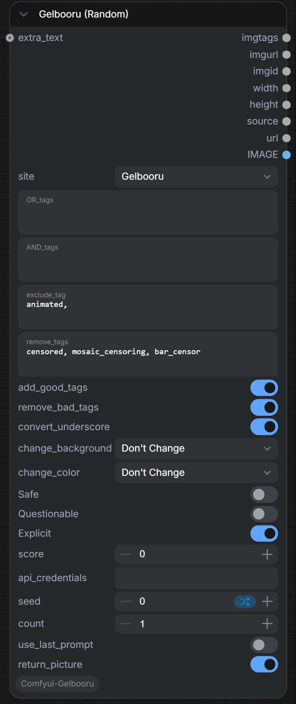

# ComfyUI-Gelbooru



A set of custom nodes for ComfyUI that fetch random images from [Gelbooru](https://gelbooru.com/) and [Rule34](https://rule34.xxx/) based on tag filters, post ID, or direct URL.

https://github.com/user-attachments/assets/e07b95f2-61e6-4d52-9d36-7eade996e720

## Installation

1. Navigate to your `ComfyUI/custom_nodes` folder
2. `git clone https://github.com/1mckw/Comfyui-Gelbooru.git`
3. From the ComfyUI root directory, install dependencies:

   ```
   python_embeded\python.exe -m pip install -r custom_nodes\Comfyui-Gelbooru\requirements.txt
   ```
4. Restart ComfyUI

## Getting API Credentials

Gelbooru **requires** an API key and user ID to fetch posts.

1. Go to https://gelbooru.com/index.php?page=account&s=options
2. Scroll to the bottom of the page
3. Copy your `api_key` and `user_id`
4. Enter them in the `api_credentials` field in this format:

```
api_key=YOUR_API_KEY&user_id=YOUR_USER_ID
```

---

## Nodes

### Gelbooru (Random)

Fetches random image posts from Gelbooru or Rule34 based on your tag filters.

| Field | Description |
|---|---|
| `site` | Image board to search: `Gelbooru` or `Rule34` |
| `OR_tags` | At least one of these tags must be present (broadens results). Comma-separated. |
| `AND_tags` | Every one of these tags must be present on the image (narrows results). Comma-separated. |
| `exclude_tag` | Tags to exclude from search results. Comma-separated. Default: `animated` to skip GIFs/videos. |
| `remove_tags` | Tags to strip from the output `imgtags`. Comma-separated. Default: `censored, mosaic_censoring, bar_censor`. |
| `add_good_tags` | Prepend quality tags (`masterpiece, best quality, amazing quality, very aesthetic`) loaded from `good_tags.txt`. `True` by default. |
| `remove_bad_tags` | Remove known bad tags (watermark, text, censored, signature, etc.) loaded from `bad_tags.txt`. `True` by default. |
| `convert_underscore` | Replace underscores (`_`) with spaces in the output tags. `False` by default. |
| `change_background` | Add or remove background-related tags. Options: `Don't Change`, `Add Background`, `Remove Background`, `Remove All`. |
| `change_color` | Add or remove color-related tags. Options: `Don't Change`, `Colored`, `Limited Palette`, `Monochrome`. |
| `Safe` | Include Safe/General rated posts |
| `Questionable` | Include Questionable/Sensitive rated posts |
| `Explicit` | Include Explicit rated posts |
| `score` | Minimum score threshold. `0` = no filter. |
| `api_credentials` | Your API key and user ID in format `api_key=xxx&user_id=xxx` |
| `seed` | Seed for deterministic random selection. `0` = truly random. |
| `count` | Number of posts to fetch per request (max 100). |
| `use_last_prompt` | Reuse the previous API response without making a new request. Useful for iterating on the same batch. |
| `return_picture` | Download the first post's image and output it as an IMAGE tensor. |
| `extra_text` | (Optional) Generated text from another node. Prepended before all post tags. |

#### AND_tags vs OR_tags

Understanding these two fields is key to getting good results:

- **AND_tags** — every tag you list here **must** be on the image. Adding more tags narrows your results.
  - Example: `1girl, smile, blonde` → only images with **all three** tags
- **OR_tags** — at least **one** of the tags you list here must be present. Adding more tags broadens your results.
  - Example: `blonde, red_hair, brown_hair` → images with **any** of these hair colors

**Typical usage:**
- AND_tags: `1girl, solo` (these are mandatory)
- OR_tags: `blonde, red_hair, brown_hair` (any hair color is fine, you want variety)
- Result: a mix of blondes, redheads, and brunettes from the same batch

#### Rating Toggles

Each rating toggle controls whether that rating is **included** or **excluded**:

- **Safe = True** (default): Safe/General posts are included. Set to `False` to exclude them.
- **Questionable = True** (default): Questionable/Sensitive posts are included. Set to `False` to exclude them.
- **Explicit = True** (default): Explicit posts are included. Set to `False` to exclude them.

The API adds rating exclusion parameters based on which toggles you disable.

#### Tag Processing Pipeline

The output `imgtags` is processed in this order:

1. **`remove_tags`** — strips user-specified tags from the raw post tags
2. **`remove_bad_tags`** — filters out known bad tags loaded from `bad_tags.txt`
3. **`change_background`** — adds or removes background-related tags
4. **`change_color`** — adds or removes color-related tags
5. **`convert_underscore`** — replaces `_` with spaces
6. **`extra_text`** — prepended before the processed post tags
7. **`add_good_tags`** — prepended at the very beginning from `good_tags.txt`

**Config files** (located in the node folder):

- **`bad_tags.txt`** — comma-separated list of tags to remove when `remove_bad_tags` is enabled. Includes watermark, censored, text, signature, ai_generated, and more (57 tags by default). Edit this file to customize.
- **`good_tags.txt`** — comma-separated list of quality tags prepended when `add_good_tags` is enabled. Default: `masterpiece, best quality, amazing quality, very aesthetic`.

**Final output structure:**
```
<good_tags>
<extra_text>
<processed post tags>
```

---

### Gelbooru (ID)

Fetches a single post from Gelbooru by its numeric post ID.

| Field | Description |
|---|---|
| `post_id` | The numeric ID of the post to fetch (e.g. `1234567`). |
| `use_last_prompt` | Reuse the previous API response without making a new request. |
| `return_picture` | Download the post's image and output it as an IMAGE tensor. |

---

### UrlsToImage

Loads images from one or more URLs into an IMAGE tensor.

| Field | Description |
|---|---|
| `urls` | Image URLs to load, one per line. Supports `http://`, `data:image/` (base64), and `s3://` URIs. |

---

## Outputs

All nodes share these common output sockets:

| Output | Type | Description |
|---|---|---|
| `imgtags` | STRING | All tags of the fetched post(s), comma-separated (one post per line). |
| `imgurl` | STRING | Direct file URL(s) of the image(s) (one per line). |
| `imgid` | STRING | Post ID(s) on the image board (one per line). |
| `width` | INT | Width of the image(s) in pixels. |
| `height` | INT | Height of the image(s) in pixels. |
| `source` | STRING | Source website URL(s) of the post(s) (one per line). |
| `url` | STRING | The full API query URL used for the request (Gelbooru Random only). |
| `IMAGE` | IMAGE | Image tensor — only populated when `return_picture` is enabled, otherwise a blank 1x1 image. |

---

## Pro Tip: Autocomplete

For a much smoother tagging experience, install [ComfyUI-Autocomplete-Plus](https://github.com/newtextdoc1111/ComfyUI-Autocomplete-Plus). It provides autocomplete suggestions for Gelbooru tags directly in ComfyUI text fields, making tag entry fast and error-free.
